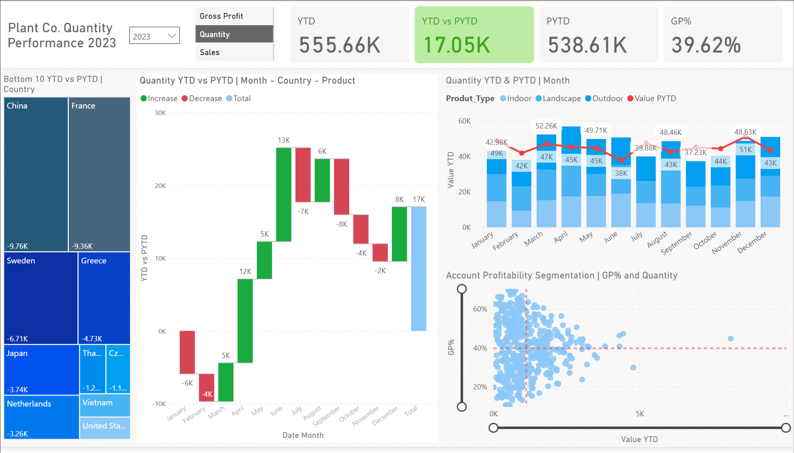

# Power BI Portfolio Project: Dynamic Performance Report



## 📌 Project Overview
This project showcases the development of a **dynamic and interactive Power BI dashboard** for a major plant company.  
The dashboard provides a **condensed performance report**, enabling users to analyze key metrics such as **Sales**, **Quantity**, and **Gross Profit** over time.  

The main focus was to utilize **advanced DAX concepts**—particularly the `SWITCH` function—and **conditional formatting** to create a **highly flexible, user-driven report**.

---

## 🚀 Key Features
- **Dynamic Measures** – `SWITCH` measures allow changing the displayed metric (Sales, Gross Profit, Quantity) across all visuals via a single slicer.
- **Time Intelligence** – Includes Year-to-Date (**YTD**) and Previous Year-to-Date (**PYTD**) measures for period-over-period analysis.
- **Conditional Formatting** – Highlights performance trends (increases/decreases) for immediate insights.
- **Intuitive Layout** – Clear KPI display and easy navigation.
- **Account Profitability Segmentation** – Scatter chart segments accounts by Gross Profit % and selected metric.

---

## 🗂 Data Model & Transformations
The data model consists of **three main tables** and supporting dimensions:

1. **Fact_Sales** – From `Plant_FACT` (renamed), with `Date_Time` converted to Date type.
2. **Dim_Account** – From `Accounts` (renamed), duplicates removed, and renamed columns:  
   - `latitude2` → `latitude`  
   - `country2` → `country`
3. **Dim_Product** – From `Plant_Hirechy` (renamed), duplicates removed in `Product_Name_id`.
4. **Dim_Date** – Created using `CALENDAR`, spanning `01-Jan-2022` to `31-Dec-2024`, with custom `Inpast` column for PYTD logic.
5. **Slc_Values** – Slicer table containing: `"Sales"`, `"Gross Profit"`, `"Quantity"`.

---

## 📊 DAX Measures & Calculations

### **Base Measures**
```DAX
Sales = SUM(Fact_Sales[Sales_USD])
Quantity = SUM(Fact_Sales[quantity])
COGS = SUM(Fact_Sales[COGS_USD])
Gross Profit = [Sales] - [COGs]
GP% = DIVIDE([Gross Profit], [Sales])
```

### **YTD & PYTD Measures**
```DAX
PYTD_Sales = CALCULATE([Sales], SAMEPERIODLASTYEAR(Dim_Date[Date]), Dim_Date[Inpast] = TRUE)
PYTD_Quantity = CALCULATE([Quantity], SAMEPERIODLASTYEAR(Dim_Date[Date]), Dim_Date[Inpast] = TRUE)
PYTD_GrossProfit = CALCULATE([Gross Profit], SAMEPERIODLASTYEAR(Dim_Date[Date]), Dim_Date[Inpast] = TRUE)

YTD_Quantity = TOTALYTD([Quantity], Fact_Sales[Date_Time])
YTD_GrossProfit = TOTALYTD([Gross Profit], Fact_Sales[Date_Time])
```

### **Dynamic SWITCH Measures**
```DAX
S_PYTD =
SWITCH(
    SELECTEDVALUE(Slc_Values[Values]),
    "Sales", [PYTD_Sales],
    "Quantity", [PYTD_Quantity],
    "Gross Profit", [PYTD_GrossProfit]
)

S_YTD =
SWITCH(
    SELECTEDVALUE(Slc_Values[Values]),
    "Sales", [YTD_Sales],
    "Quantity", [YTD_Quantity],
    "Gross Profit", [YTD_GrossProfit]
)

YTD vs PYTD = [S_YTD] - [S_PYTD]
```

### **Dynamic Titles**
Measures dynamically update chart titles based on slicer selections, enhancing interactivity.

---

## 📽 Presentation & Resources
- **YouTube Tutorial (inspiration):** [Watch Here](https://www.youtube.com/watch?v=BLxW9ZSuuVI)  
- **Video Presentation (Google Drive):** [View Here](https://drive.google.com/file/d/1Z2VfKM-P-z_shGIgOMPyfabBxDaM2cDe/view?usp=sharing)

---

## 📂 Files in This Repository
- `dashboard.png` – Dashboard preview image
- `README.md` – Project documentation
- `.pbix` file – Power BI report (available via request or linked storage)

---

## 💡 Author
**Kavidu Lakshean** – Final-year Technology Management student, Full-Stack Developer & Business Analyst.  
